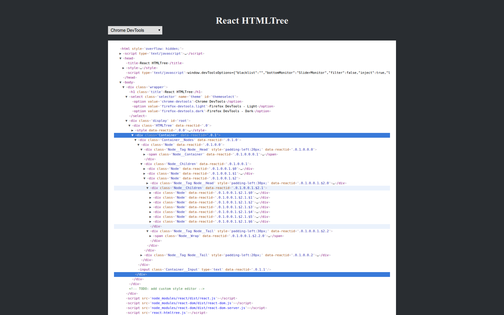
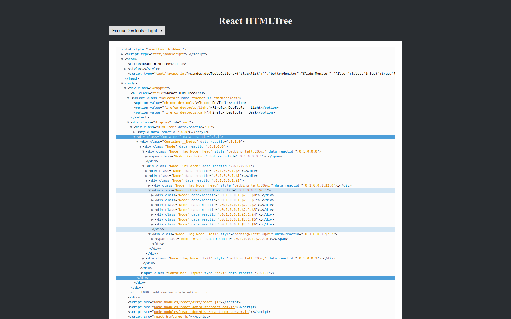
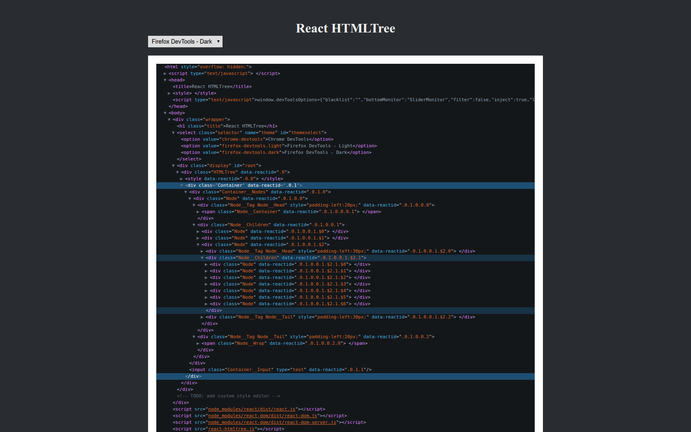

[](https://github.com/feross/standard)

# React HTMLTree

> TreeView for HTML/XML structures

The motivation for this component was the lack of a standalone TreeView for HTML documents,
which can be easily integrated. Existing solutions are often tightly coupled into specific projects
or don't provide necessary customizations options. While its original is based on the TreeView
implementation of [react-devtools](https://github.com/facebook/react-devtools/blob/master/frontend/Node.js),
additional improvements regarding performance and usability were done.

Checkout the [example in your browser]( https://autarc.github.io/react-htmltree).

<div alignt="center">
  
  
  
</div>

## Features
- standalone react module with inline style definitions
- default themes include 'Chrome' and 'Firefox' visuals
- mimics common devtools behavior (like history or uncollapse all descendants)
- supports universal rendering through difference source types
- keeps synchronized with as HTML is referenced


## Use Cases
- document viewer
- devtools extension
- visual debugging
- interactive markup


## How To use

```js
import HTMLTree from 'react-htmltree'

<HTMLTree source={document.documentElement}/>
```
source: Text | React Component | HTMLElement


### Handle Events

```js
<HTMLElement source={document.documentElement} onSelect={handleSelect}/>

// others events include: 'hover', 'expand' and 'unfocus'
function handleSelect (element, component) {
  console.log(element)
}
```

### Use custom renderer

```js
<HTMLElement source={'<ul><li>1</li><li>2</li></ul>'} customRender={customRender}/>

// create wrapper around the matched components
function customRender (decorate, node) {
  return decorate(function (Component) {
    if (node.name === 'script') {
      return (
        <div style={{ backgroundColor: 'red' }}>
          <Component {...Component.props}/>
        </div>  
      )
    }
  })
}
```
Further examples can be found [here](./examples).


## Development
To build your own version run `npm run dev` for development (incl. watch) or `npm run build` for production (minified).


## TODO
- extend example page with style generator
- checkout memory issue after theme change
- only render elements in the current viewport (reuse DOM nodes)
- allow object declaration for a styling a custom theme regarding [freestyle](https://github.com/blakeembrey/free-style)
- prevent duplicate inline style imports for the select theme
- extend documentation ([react-docgen](https://github.com/reactjs/react-docgen))
- add tests for the component using ([enzyme](https://github.com/airbnb/enzyme))
- checkout the original styles of the developer tools (chrome ? firefox ?)
- support syntax highlighting for inline scripts / style elements
- check rendering using web worker for more efficient updating (diff checks)
~ [react-worker-dom](https://github.com/web-perf/react-worker-dom) / [#3092](https://github.com/facebook/react/issues/3092)
- adapt further features from browser devtools:
  - wrap dotted border around each specific (firefox)
  - tags with no content are less saturated (firefox)
